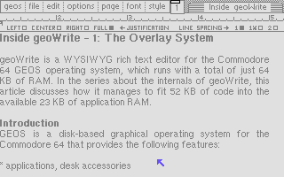

# geoWrite Source Code

by Berkeley Softworks, reverse engineered by *Michael Steil*.

## Description

geoWrite is a WYSIWYG rich text editor for the Commodore 64 GEOS operating system. 

Like [GEOS](https://github.com/mist64/geos), it has extremely low hardware requirements:

* a **MOS 6502**-compatible CPU (usually at 1 MHz or higher)
* **64 KB** of RAM
* one **disk drive** (typically 170 KB)
* a **320x200** monochrome screen
* a **pointing device**

With just **35 KB** of binary code, geoWrite has the following features:

* graphical, menu-based user interface
* WYSIWYG ("What You See Is What You Get")
* up to 8 proportional pixel fonts per document
* bold, italics, underline, outline, subscript, superscript
* left aligned, right aligned, centered, justified
* variable line spacing (1, 1.5 and 2)
* variable left and right margins; paragraph margins
* regular and decimal tabs
* headers and footers
* inline images
* documents up to 62 pages
* English and German version

## Source

This is the reverse engineered source code of the English and German versions of geoWrite 2.1 for the Commodore 64.

The source has been heavily reorganized, nevertheless, a standard compile will generate binaries that are identical with the English/German geoWrite 2.1 distribution binaries.

## Requirements

* make
* [cc65](https://github.com/cc65/cc65) for assembling and linking
* Python for encrypting some protected/obfuscated code

## Building

Entering

    make

will build the English version. To build the German version, enter

    LOCALE=de make

The build output will be in `build/en` and `build/de`, respectively.

The resulting files are the individual VLIR records, the file header, and the copy protection sector:

    geoWrite-0.bin
    geoWrite-1.bin
    geoWrite-2.bin
    geoWrite-3.bin
    geoWrite-4.bin
    geoWrite-5.bin
    geoWrite-6.bin
    geoWrite-7.bin
    geoWrite-8.bin
    geoWrite-fhdr.bin
    protection.bin

The build process can re-create a flat "CVT" VLIR file with metadata (track & sector data, time stamp) fixed to values from `geoWrite_en_2.1_1988-07-06.cvt` file.

To prepare cvt file enter

    make && make cvt

## Binary Collection

The `orig` subdirectory contains a collection of different versions of geoWrite:

| Names                                   | Description    |
|-----------------------------------------|----------------|
| `geoWrite_en_1.0-1986-03-07`            | English 1.0
| `geoWrite_en_1.1-1986-04-07`            | English 1.1
| `geoWrite_en_1.1-1986-04-07_alt`        | English 1.1 (alternate version)
| `geoWrite_es_1.1_1986-04-07`            | Spanish 1.1
| `geoWrite_en_1.3-1986-10-05`            | English 1.3 (original version)
| `geoWrite_en_1.3-1987-07-17`            | English 1.3 (updated version)
| `geoWrite_de_1.3-1987-10-16`            | German 1.3
| `geoWrite_en_2.0-1986-10-05`            | English 2.0 (geoWrite Workshop box)
| `geoWrite_en_2.1_1987-09-27`            | English 2.1 (geoWrite Workshop box)
| `geoWrite_de_2.1_1987-12-11`            | German 2.1 (geoWrite Workshop box)
| `geoWrite_en_2.1_1988-07-06`            | English 2.1 (bundled with GEOS 2.0)
| `geoWrite_de_2.1_1989-01-03`            | German 2.1 (bundled with GEOS 2.0)
| `geoWrite_de_2.1_1996-02-08_ww`         | German 2.1, unofficial Werner Weicht patches
| `geoWrite_de_2.2_1993-08-08_fr`         | German 2.1, unofficial Falk Rehwagen patches
| `geoWrite_de_2.2_1996-02-10_fr_ww`      | German 2.1, unofficial Falk Rehwagen/Werner Weicht patches
| `geoWrite_de_2.2_1996-11-04_fr_ww`      | German 2.1, unofficial Falk Rehwagen/Werner Weicht patches (Update)
| `geoWrite_de_2.1_1989-01-03_plus4`      | German 2.1, unofficial Plus/4 patches
| `geoWrite_de_2.1_1989-01-03_plus4_alt`  | German 2.1, unofficial Plus/4 patches (alternate version)
| `geoWrite_de_2.1_1989-01-03_plus4_alt2` | German 2.1, unofficial Plus/4 patches (alternate version 2)

* The date codes are taken from the application's last modified dates.
* It is unknown whether this contains all official versions. Was there a 1.2 version? Were there German 1.0/1.1/1.2 versions? Were there any more localized versions?
* The FR/WW patched versions have been created by applying the respective "Patch System" patches to the German 2.1 version.
* The source in this repo produces the GEOS-bundled versions of geoWrite 2.1, i.e. the last official versions.

## Status

The code has not been completely commented yet:

| Component | Status |
|-----------|--------|
| Record 0: MAIN: library code, core text editing | 90% |
| Record 1: init, copy protection | 100% |
| Record 2: core text editing | 30% |
| Record 3: cut, copy, paste | 100% |
| Record 4: ruler editing | 20% |
| Record 5: startup/about, create, open, version conversion, paste text, run desk accessory | 80% |
| Record 6: navigation, search/replace, header/footer, repaginate | 70% |
| Record 7: printing | 20% |
| Record 8: print settings | 10% |
| Copy Protection | 100% |

## TODO

* Comment the remainder of the code.
* Incorporate the Werner Weicht, Falk Rehwagen and Plus/4 patches as `.ifdef`s.

## Contributing

Pull requests are greatly appreciated. Please keep in mind that a default build must always recreate the original binaries (`geoWrite_en_2.1_1988-07-06` and `geoWrite_de_2.1_1989-01-03`).

## Documentation

There is a series of articles on the internals of geoWrite at [www.pagetable.com](https://www.pagetable.com/):

* Part 1: [The Overlay System](https://www.pagetable.com/?p=1425)
* Part 2: [Screen Recovery](https://www.pagetable.com/?p=1428)
* Part 3: [Font Management](https://www.pagetable.com/?p=1436)
* Part 4: [Zero Page](https://www.pagetable.com/?p=1442)
* Part 5: [Copy Protection](https://www.pagetable.com/?p=1449)
* Part 6: [Localization](https://www.pagetable.com/?p=1460)
* Part 7: [File Format and Pagination](https://www.pagetable.com/?p=1471)
* Part 8: [Copy & Paste](https://www.pagetable.com/?p=1481)
* Part 9: [Keyboard Handling](https://www.pagetable.com/?p=1490)

## License

For the underlying work on GEOS, please respect its license.

The intellectual property added by the reverse-engineering and the subsequent improvements is in the public domain, but the authors request to be credited.

## Authors

geoWrite was initially developed by Berkeley Softworks in 1985-1988.

In 2020, [Michael Steil](mailto:mist64@mac.com) re-assembled the sources into cc65/ca65 format and did the reverse-engineering.
